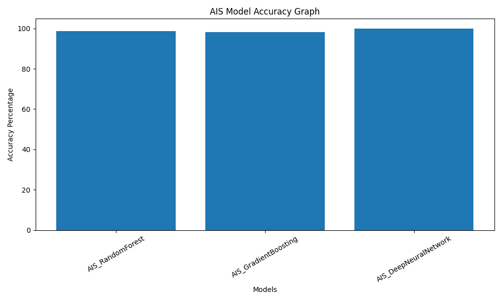

# 🏛️ Scheduled Caste Population Growth & Demographic Forecasting System

## 🧠 Scheduled Caste Population Distribution Prediction using Machine Learning & Bio-Inspired Optimization 

---

## 👤 Author

**Sagnik Patra**

---

## 📌 Project Overview

This project builds an end-to-end **Scheduled Caste Population Growth & Demographic Forecasting System** using Machine Learning and Bio-Inspired Optimization Algorithms.

The system analyzes Scheduled Caste population statistics from Census datasets, performs feature engineering, applies optimization-based feature selection, and predicts future Scheduled Caste population percentages using optimized machine learning models.

The project automatically generates:

- Prediction CSV files
- Result CSV files
- H5 model files
- PKL model files
- YAML configuration files
- JSON result files
- Accuracy reports
- Visualization graphs
- Heatmaps
- Optimization progress graphs

---



---

## 🎯 Objectives

- Analyze Scheduled Caste population growth trends
- Predict future Scheduled Caste population percentages using machine learning
- Perform feature engineering on census demographic data
- Optimize feature selection using bio-inspired algorithms
- Generate prediction and result reports
- Save trained models and configuration files
- Visualize model performance and optimization progress

---

## ⚙️ Tech Stack

- Python
- Pandas
- NumPy
- Scikit-learn
- TensorFlow / Keras
- Matplotlib
- Seaborn
- Joblib
- YAML
- JSON

---

## 🧬 Optimization Algorithms Used

- AIS – Artificial Immune System
- CSA – Clonal Selection Algorithm
- PSO – Particle Swarm Optimization
- QPSO – Quantum Particle Swarm Optimization
- BA – Bat Algorithm
- HSA – Harmony Search Algorithm
- GA – Genetic Algorithm

---

## 📂 Dataset

```text
Percentage_of_Scheduled_Caste_Population_to_Total_Population.csv
